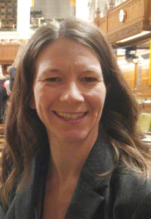

Data and daily decision-making go hand-in-hand. From finding the cheapest gas in an area with multiple gas stations to determining the healthiest meal choices for dinner — we often look at multiple data sets to find patterns and, from there, decide what to do. There’s another word for this process – data science.

One of&nbsp;<a href="https://www.callysto.ca/" target="_blank" rel="noopener noreferrer">Callysto’s</a>&nbsp;goals is to teach everyday data science to students. Our experts do this through our&nbsp;<a href="https://www.callysto.ca/learning_modules/" target="_blank" rel="noopener noreferrer">curriculum-based modules</a>&nbsp;and by sharing “how to’s” from teachers. So, let’s introduce you to one such teacher: Stephanie Strong! Stephanie is a Grades 7-9 teacher and a Grades 1-9 home-education facilitator in Alberta. In this post, she explains how she incorporated data science into her lesson plans.

<h2 class="wp-block-heading"><strong>Necessity is the mother of invention</strong></h2>

<figure class="alignright size-large"><figcaption>Pictured above: teacher Stephanie Strong. </figcaption></figure>

Stephanie started her career teaching a group of Grades 7-9 students in a program that in many ways resembled a one-room schoolhouse. Adding data science to her lessons came out of necessity — in order to make it through the programs of study, she needed to simultaneously teach multiple skills over a variety of subjects.

“I saw that there were areas where subjects overlapped,” she explains. “I also thought, ‘why don’t we learn how to communicate about a subject in different ways?’ I didn’t want to compartmentalize learning into discrete subjects; it’s not how the world works.”

There were a variety of ways Stephanie added data science to her lessons. For example, she teaches probability in social studies through a game called, “Would you survive the Middle Ages?” Students use a 10-sided die to establish the European region that they are from, and their position in the feudal hierarchy, before trying to extend their family tree to survive the middle ages. They use coins to determine their child’s gender (heads: male; tails: female) and mortality (heads: survive; tails: die). As the game progresses, students determine each family member’s mortality and marriageability with a roll of the 10-sided die. Based on historical data, mortality and marriageability varies depending on the stage of life of each family member.

“Adding data science was also a way to either reinforce or introduce concepts into their math classes,” says Stephanie. “It helps students dip their toes into what they will be learning.”

<h2 class="wp-block-heading"><strong>Data science in Stephanie’s classroom today</strong></h2>

Stephanie continues to add dashes of data science into her classroom today.

<ul><li><strong>Looking at percentages in social studies:</strong>&nbsp;Based on the book,&nbsp;<em>If the World Were a Village</em>, Stephanie has created another game. Students roll a die for specific categories (i.e. access to clean water, relative wealth, and literacy rate); each category has a point value. The total value of their rolls results in their human-development index number, which students use to find a corresponding country. Once they’ve found their applicable country, it becomes a research project.</li><li><strong>Variables with the Settlers of Catan game:</strong>&nbsp;In order to teach different economic systems, Stephanie often plays this game with her students, in which players have to collect resources to build settlements. The rules change with every economic system. She says it provides a good understanding of how different variables work, and how to count several data sets.</li></ul>

<h2 class="wp-block-heading"><strong>Up next: Computational thinking.</strong></h2>

Stephanie is interested in adding computational thinking concepts to her classes. To get a head start, she enrolled in a test-pilot group for Callysto’s computational thinking course. The free course teaches computational thinking concepts for the classroom, including coding, and will be publicly launched in early 2020.

“I see coding as the next level of problem solving; I want those skills,” she says. “It will also be relevant to students — they can learn different ways to solve problems, and I can use those skills to enhance how I currently teach problem solving.”

<h2 class="wp-block-heading"><strong>Why data science matters</strong></h2>

For Stephanie, teaching data science is about teaching students life skills.

“I see my role as teaching them how to think critically. My job isn’t to get them to memorize stuff,” she explains. “I want to know, ‘do you have good research skills? Can you solve a problem?’ I want them to be able to break things apart so that they can understand how those things work.”

She also believes teaching data science is an opportunity to positively model how to handle mistakes.

“It’s powerful for students to see their teachers make mistakes, and what they do to fix them,” says Stephanie. “For instance, in one of my classes, I was explaining the difference between popular votes and seats in the House of Commons as a data science example. I messed up, and one of my students fixed it. The point is we’re much more intelligent collectively than independently.”

<h3 class="wp-block-heading"><strong>Are&nbsp;you a teacher? Tell us how you’re helping students learn&nbsp;computational thinking.</strong></h3>

If you’re a teacher and want to share how you are using data science and computational thinking in your classrooms, email&nbsp;<a href="mailto:contact@callysto.ca">contact@callysto.ca</a>.&nbsp;We look forward to hearing from you!
