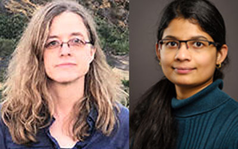

The <a rel="noopener noreferrer" href="https://www.callysto.ca/2019/10/09/teaching-computational-thinking-and-coding-get-funds-for-your-classroom-activities/" target="_blank">Callysto Call for Proposals</a> funds activities supporting coding and computational thinking skills among Grades 5-12 students and teachers across Canada. Meet one of our phase 1 recipients, <a rel="noreferrer noopener" href="https://hightechu.ca/" target="_blank">HighTechU</a>! They’re running a <a rel="noreferrer noopener" href="https://www.eventbrite.ca/e/quantum-computing-a-hands-on-experience-with-jupyter-notebooks-and-qiskit-tickets-85710270727" target="_blank">quantum computing workshop</a> for high school students on January 25, 2020 at the University of Victoria. HighTechU team members Ulrike Stege and Prashanti Priya Angara took the time to sit down with Callysto and tell us more about quantum computing and the event

<h2 class="wp-block-heading">What is quantum computing?</h2>

<figure class="alignright size-large"><figcaption>Ulrike Stege (left) and Prashanti Priya Angara (right)</figcaption></figure>

“Quantum computing is different from our everyday, or classical, computing. You see classical computing everywhere — from laptops, to smartphones, to toasters. Quantum computing is a new form of computing that excels at specific kinds of problems. Quantum computers give the opportunity to design efficient solutions for problems that have not been solved or cannot be solved efficiently by classical computing. For example, one application area where quantum computing promises breakthroughs is in simulating molecules and chemical reactions. Classically, this was only possible for very small molecules. Even with the most powerful supercomputers, we can only approximate chemical reactions. With quantum computers, we can potentially model atoms and molecules exactly like they behave in a test tube. Why could this lead to breakthroughs and major advancements? Simulating nature with high fidelity could give us new insights, enable deeper understanding of protein folding and, in turn, create custom enzymes, and aid the development of personalized medicine or catalysts for clean energy.

The quantum bit, or “qubit”, is the fundamental information unit of quantum computing. A qubit’s ground states are |0&gt; and |1&gt;. At any time during computation, a qubit is in superposition, which is a linear combination of the two ground states. This means that during computation, a qubit can be in an infinite number of states. However, we can only know the state of a qubit through measuring. Measuring a qubit turns it into a classical bit, which has a value of either 0 or 1. If two qubits are in a state of entanglement, then they are tightly correlated such that when the measurement value of one of the qubits is known, it instantly and uniquely determines the value of the second qubit — regardless how far apart the two entangled qubits are physically. Superposition and entanglement are key differentiators between quantum and classical computing.”

<h2 class="wp-block-heading">Why is quantum computing important?</h2>

“Quantum computing leverages the properties of materials at the atomic level. At this particular scale, physical systems are no longer governed by classical physics; they’re governed by quantum mechanics. Here is where quantum computing comes into play. Can we leverage some of the interesting characteristics of quantum phenomena for computation? While research into quantum computing is not new, only recently have promising quantum computers been built and made accessible via the cloud. With Google’s quantum supremacy announcement, there is a renewed confidence that quantum computing might solve some challenging problems.”

<h2 class="wp-block-heading">Why is HighTechU hosting a quantum computing workshop?</h2>

“HighTechU aims to bring cutting edge technology to high school students and give them the opportunity to gain hands-on experience in these areas, and also, develop an understanding of what a career in such promising areas might look like. Quantum computing has received a lot of attention recently, including in Canada. For example, on October 2, 2019 the B.C. Government announced the new B.C. Institute for Quantum Algorithms.&nbsp;

Tens of thousands of users have been able to access quantum computing hardware and simulators through cloud services offered by IBM, Microsoft, Google, D-Wave Systems, Fujitsu, and Amazon. A number of start-ups in Canada work in quantum computing, including D-Wave, 1QBit, Xanadu or Quantum Benchmark. We can expect the development of quantum computing to continue and that highly qualified people will be in high demand. With this workshop, we want to raise interest in this cutting-edge technology and highlight employment opportunities available now and in the near future.”

<h2 class="wp-block-heading">The workshop description notes IBM’s “Qiskit” and Jupyter notebooks will be used. Why these tools?</h2>

“IBM is not only a leader in quantum computing but also quantum education and training. In 2016, IBM Research with its IBM Q Network and Experience platform was the first company to provide the general public with access to real quantum computers. Qiskit, based on Python, is arguably the most popular open-source quantum computing software development framework for leveraging quantum processors in research, education, and business. Jupyter notebooks allow users to create and share documents that integrate live code, narrative text and visualizations. Quantum computing experiments are programmed in Qiskit and disseminated effectively using Jupyter Notebooks making them ideal for teaching.”

<h2 class="wp-block-heading">What will high school students learn from this workshop?</h2>

“Through this workshop, we hope high school students will get a taste of what quantum computing is all about. Students can gain motivation for their high school mathematics and physics courses. Students have many areas that they could pick after finishing high school; being aware of this exciting new world of quantum computing will expand their range of options.”

<h2 class="wp-block-heading">What did it mean for HighTechU to receive Callysto Call for Proposals funding?</h2>

“We are deeply indebted to Callysto for providing the funding to create this quantum computing course for high school students. To provide this eye on the future would not be possible without Callysto’s funding. This is HighTechU’s first workshop in quantum computing. Developing materials in a new field takes significant time and energy, particularly for a new field like this. Also, since quantum computing relies on principles that are commonly viewed as non-intuitive, with the funding we were able to acquire props and other hands-on materials to help get familiar with these quantum computing concepts.”
