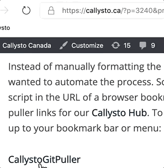

Callysto learning modules are Jupyter notebooks stored on <a href="https://github.com/callysto" target="_blank" rel="noopener">GitHub</a>, which is an online code-sharing site. A Jupyter notebook is a type of document that can include formatted text, live code, and visualizations.

You can share a notebook with your students, or colleagues, using a specially-formatted link that creates a copy for each person that clicks it.

<h2 class="wp-block-heading">Sharing Callysto notebook links with students or colleagues</h2>

<ol><li>Go to the Callysto “<a href="https://www.callysto.ca/learning_modules/" target="_blank" rel="noopener">Learning Modules</a>” page</li><li>Select a module you’re interested in, you can sort by grade or subject, or pick one of the “featured” modules</li><li>Right-click the link to copy it, then share with your students</li><li>They (and you) sign in to the <a href="http://hub.callysto.ca/" target="_blank" rel="noopener">Callysto Hub</a> with a Google or Microsoft account (we don’t collect any data about users)</li><li>Students click the link you sent in order to get their own copy of the notebook</li></ol>

<h2 class="wp-block-heading"><b>Sharing Jupyter notebooks you create or find</b></h2>

To do this, we created a “bookmarklet” called <a href="javascript:(function(){var url=location.href;var res=url.split(&quot;/&quot;);var site=res[2];var user=res[3];var repo=res[4];var treeBlob=res[5];var branch=res[6];var nbgitputllerUrl=&quot;https://hub.callysto.ca/jupyter/hub/user-redirect/git-pull?repo=&quot;;if(site==&quot;github.com&quot;){if(treeBlob){var subPath=url.substring(url.indexOf(branch)+branch.length+1);nbgitputllerUrl+=encodeURIComponent(&quot;https://github.com/&quot;+user+&quot;/&quot;)+repo+&quot;&amp;branch=&quot;+branch+&quot;&amp;subPath=&quot;+subPath+&quot;&amp;depth=1&quot;;}else{nbgitputllerUrl+=url;}}window.prompt(&quot;Callysto nbgitpuller link&quot;,nbgitputllerUrl);})();">CallystoGitPuller</a>. That’s a piece of code you can drag and drop into your “bookmarks” bar on your browser.

<h3 class="wp-block-heading"><strong>Set up the bookmarklet:</strong></h3>

Drag the text <a href="javascript:(function(){var url=location.href;var res=url.split(&quot;/&quot;);var site=res[2];var user=res[3];var repo=res[4];var treeBlob=res[5];var branch=res[6];var nbgitputllerUrl=&quot;https://hub.callysto.ca/jupyter/hub/user-redirect/git-pull?repo=&quot;;if(site==&quot;github.com&quot;){if(treeBlob){var subPath=url.substring(url.indexOf(branch)+branch.length+1);nbgitputllerUrl+=encodeURIComponent(&quot;https://github.com/&quot;+user+&quot;/&quot;)+repo+&quot;&amp;branch=&quot;+branch+&quot;&amp;subPath=&quot;+subPath+&quot;&amp;depth=1&quot;;}else{nbgitputllerUrl+=url;}}window.prompt(&quot;Callysto nbgitpuller link&quot;,nbgitputllerUrl);})();">CallystoGitPuller</a>&nbsp;to your bookmark bar or menu.

<figure class="wp-block-image"></figure>

If your bookmark bar isn’t visible, these instructions will help for&nbsp;<a href="https://support.google.com/chrome/answer/188842" target="_blank" rel="noopener">Chrome</a>,&nbsp;<a href="https://support.mozilla.org/en-US/kb/bookmarks-toolbar-display-favorite-websites" target="_blank" rel="noopener">Firefox</a>,&nbsp;or&nbsp;<a href="https://support.microsoft.com/en-us/help/4028699/microsoft-edge-see-your-favorites-bar" target="_blank" rel="noopener">Edge</a>.

<h3 class="wp-block-heading">To use the bookmarklet:</h3>

<ol><li>Find a notebook on a GitHub page, for example this notebook using <a rel="noopener" href="https://github.com/misterhay/Interesting-Problems/blob/master/gapminder-ifm-tfr.ipynb" target="_blank">Gapminder data to explore child mortality and birth rate</a></li><li>While that GitHub notebook is on your screen, click on the <a href="javascript:(function(){var url=location.href;var res=url.split(&quot;/&quot;);var site=res[2];var user=res[3];var repo=res[4];var treeBlob=res[5];var branch=res[6];var nbgitputllerUrl=&quot;https://hub.callysto.ca/jupyter/hub/user-redirect/git-pull?repo=&quot;;if(site==&quot;github.com&quot;){if(treeBlob){var subPath=url.substring(url.indexOf(branch)+branch.length+1);nbgitputllerUrl+=encodeURIComponent(&quot;https://github.com/&quot;+user+&quot;/&quot;)+repo+&quot;&amp;branch=&quot;+branch+&quot;&amp;subPath=&quot;+subPath+&quot;&amp;depth=1&quot;;}else{nbgitputllerUrl+=url;}}window.prompt(&quot;Callysto nbgitpuller link&quot;,nbgitputllerUrl);})();">CallystoGitPuller</a> bookmarklet in your bookmark bar or menu</li><li>Copy the link that pops up. This is the specially-formatted link that creates a copy of that notebook in a Callysto Hub account</li><li>Share the link with students or colleagues, or perhaps&nbsp;<a rel="noopener" href="https://bitly.com/blog/how-do-i-shorten-a-url/" target="_blank">shorten it</a> first</li></ol>

<h2 class="wp-block-heading">Questions?</h2>

If you need help, email us at&nbsp;<a href="mailto:contact@callysto.ca" target="_blank" rel="noopener">contact@callysto.ca</a>.

