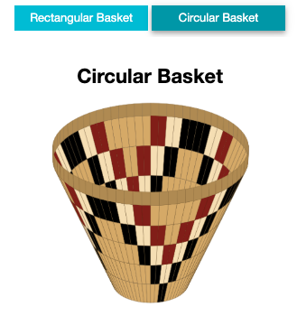

A free interactive learning platform that brings computational thinking, coding, and data science skills into classrooms is rolling out across the country, thanks to new funding from the national CanCode program.

Callysto is a curriculum-based learning and skills development platform for students in Grades 5-12 that is accessible from any device with an internet connection. The tool was developed by the not-for-profit technology and learning organizations, <a href="https://www.cybera.ca/" target="_blank" rel="noreferrer noopener">Cybera</a> and the <a href="https://www.pims.math.ca/" target="_blank" rel="noreferrer noopener">Pacific Institute for Mathematical Sciences (PIMS)</a>. Their goal is to help students strengthen their digital capabilities using the latest open-source technologies.

<h2 class="wp-block-heading">What Callysto Offers Classrooms</h2>

“Callysto enhances the learning experience by adding interactive or analytical elements to a basic lesson, helping students go beyond the textbook and actually play with the data,” says Barb Carra, President and CEO of Cybera. “This not only makes the lesson more interesting, but also develops the students’ digital literacy and computational thinking skills.”

The interactive “digital textbook” features free open-source tools such as Jupyter notebooks, a web platform widely used by industry and universities to freely share research and discoveries. The platform marries traditional reports (including text and images) with interactive elements — including multimedia that can be manipulated by the viewer, or tables that are continuously updated with real-time data.

<h2 class="wp-block-heading">How Callysto is Used in the Classroom</h2>

<a href="http://bit.ly/call-salish-baskets">

</a>

Working with educators, Cybera and PIMS have so far developed over 100 different learning module “notebooks” to complement existing Canadian curricula.

One of the learning modules was built to complement a Grade 9 science lesson on water conductivity. Students measuring the conductivity of different liquid solutions can record their results in the interactive notebook, and compare their numbers to live data readings from an Edmonton-based municipal water treatment plant. When there is a major change in the readings, as happened in Spring 2019 when students in one class noticed a sudden spike in conductivity at the Edmonton facility, they could further extrapolate the data to uncover what caused the change. (In this case, a large snowmelt created the conductivity spike). This, in turn, provides real-world and real-time context to traditional classwork.

Another module accompanies a Grade 5 social studies/math lesson that looks at the patterns of Indigenous basket weaving. While exploring the geometric motifs of the traditional basket weaving of the Tla’amin Nation, students can manipulate a 3D model of a basket to create their own unique geometric design.

“As coding and digital literacy —including data analytics — have become more foundational to Canadian education and citizenship, we wanted to create a fun and dynamic platform for students to practice and develop computational thinking skills, within and beyond the traditional curriculum,” says Professor James Colliander, Director of PIMS.

<h2 class="wp-block-heading">Here’s What Teachers and Students Say</h2>

Since 2018, over 750 Canadian teachers have been trained on Callysto. David Hay, a Grade 6 teacher from Sherwood Park, Alberta, was an early adopter of Callysto in his classroom, and is currently on a year-long sabbatical to help other teachers start using it. “Knowing how to ask computers the right questions, or how to set up basic code, are important skills that more and more jobs are starting to require,” he says. “Developing these abilities now will help students better market themselves for jobs in the future.”

Students who were introduced to Callysto have commented on how easy it is to use, even for those new to coding.

“It was fun to play with the interactive nature of the code and think about how I could use this in real life,” said a Grade 9 student from Toronto who trialled the tool at a March 2019 math camp.

“I want to do more of this stuff in class,” said a 10-year old from the same camp. “All of the Callysto lessons were created in a way that is easy to understand and makes computational thinking and coding fun to learn.”

Cybera and PIMS have set up an online repository to publicly share the learning modules created through Callysto, and will be adding more training content in the coming months. They are also planning on holding new training events across the country, and are seeking input from teachers and school boards to guide the next phase of module development.

For more information about the program and partnership opportunities, visit Callysto.ca or e-mail <a href="mailto:contact@callysto.ca" target="_blank" rel="noreferrer noopener">contact@callysto.ca</a>.
