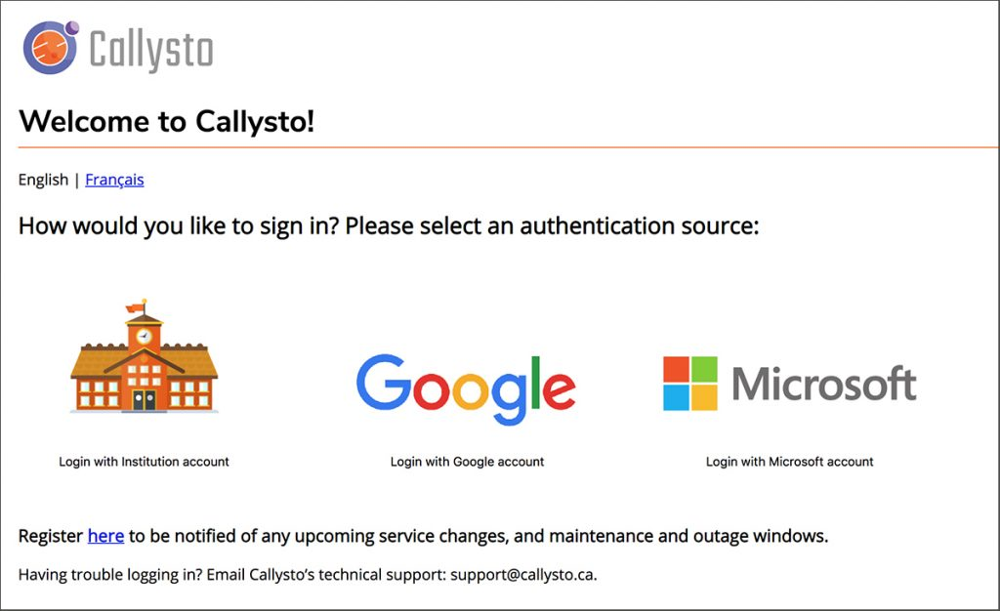
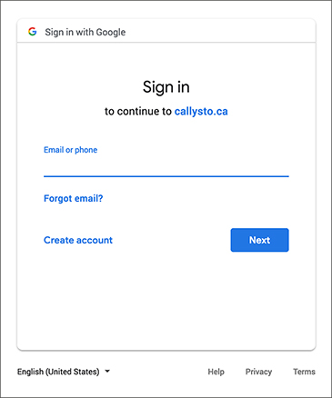

To reinforce the security and privacy of Callysto users’ personal information, we have launched a new authentication feature for the platform. Authentication provides users with a simple access experience to Callysto (and the platform on which Callysto is based, <a href="http://jupyter.org/" data-wplink-edit="true">Jupyter</a>), while ensuring users’ login credentials and online identities remain uncompromised.

<h2 class="wp-block-heading"><b>What does authentication mean? </b></h2>

Authentication is the process of verifying the identity of each individual user, in this case, mainly students and teachers. Authentication is important because it protects Callysto’s networks and systems from unauthorized users and potential external threats, while also protecting the private information of each connected institution (i.e. school district), and the personal identity of each individual user (i.e. student). 

<h2 class="wp-block-heading"><b>How does Callysto’s authentication application work? </b></h2>

Signing onto Callysto’s education platform is a quick and easy process for the user. But behind the scenes, these are the steps taking place:

1. A user visits the <a rel="noreferrer noopener" href="https://hub.callysto.ca/" target="_blank">Callysto</a> portal and is asked to login.

2. Callysto generates a Security Assertion Markup Language (SAML) request. A SAML is the process used by the identity provider and the service provider (in this case, Callysto) to exchange authentication and authorization data.

3. The user is redirected to Callyto’s new authentication source page, where they choose their education institution, or another identity provider (IdP) (such as Google or Microsoft).

<figure class="aligncenter size-full"></figure>

4. The IdP authenticates the user by asking them to enter their credentials (username and password).

<figure class="aligncenter size-large"></figure>

5. After validating, the IdP generates a <a rel="noopener noreferrer" href="https://en.wikipedia.org/wiki/Identity_provider_(SAML)" target="_blank">SAML</a> response.

6. The user is directed back to Callysto with the SAML response message, indicating that they have been authenticated. This is where the “ID hashing” of the user takes place. Hashing is a method of encrypting or disguising a user’s identifier (usually username or email address) for privacy reasons. The identifier becomes unrecognizable, and therefore cannot be traced back to the user’s personal information. However, other formulaic characteristics attached to the encrypted ID (such as email address) can still be used by the service and identity providers to grant them access to the user.  

7. Callysto validates the response message and gives the user permission to access the Callysto platform.

8. The user enters and begins using the platform.

<h2 class="wp-block-heading"><b>Besides security what are the other benefits of using an authentication application?</b></h2>

The authentication application also provides users with a single sign-on feature, eliminating the need to remember multiple passwords for multiple applications. The user can login to Callysto through one of their identity providers (such as a <a href="https://www.cybera.ca/services/pika-federation/" target="_blank" rel="noopener noreferrer">Pika</a>-serviced school district, or Google or Microsoft), and through this login access multiple other applications, without having to re-enter their name and password.

<h2 class="wp-block-heading"><b>How did Cybera develop the authentication piece? </b></h2>

We wanted a way to maintain as little user data as possible, and also ensure that any information we did acquire could not be used to identify, or be traced back to a specific individual. We built the new Callysto authentication using a similar technology to what we developed for the Pika Federation, but with an emphasis on privacy.

<h2 class="wp-block-heading"><b>What is unique about Callysto’s version of this application?</b></h2>

Up until now, there has been no multi-authentication feature in Jupyter, meaning it had simply created separate instances for each authorized post-secondary institution. For example, you could only authenticate with Google OR Microsoft accounts on a single installation, but not both. Because Callysto exists on only one instance of Jupyter, this allows the program to authenticate users from multiple organizations, and securely segregate user data depending on which institution they are accessing from. 

<h2 class="wp-block-heading"><b>Would this application be useful to others (i.e. other Jupyter developers)?</b></h2>

Absolutely! Anyone who wants to allow multiple organizational logins to Jupyter can benefit from this authentication software (<a href="https://simplesamlphp.org/" target="_blank" rel="noopener noreferrer">SimpleSAMLphp</a>). The software also allows for any number of <a href="http://openid.net/connect/" target="_blank" rel="noopener noreferrer">OpenID Connect</a> or SAML Identity Providers to be attached, which makes it very scalable. The Callysto program code for infrastructure and configuration is open source and available through <a href="https://github.com/callysto/infrastructure">Github</a>.
