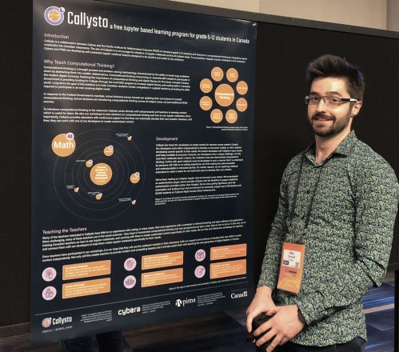
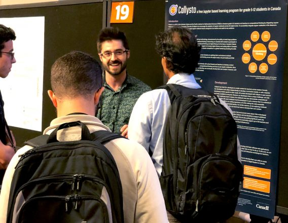

<figure class="alignright size-large"></figure>

This past August, myself and fellow Cybera data sciencer Byron Chu, as well as some colleagues from the Pacific Institute of Mathematics (<a href="https://www.pims.math.ca/" target="_blank" rel="noopener noreferrer">PIMS</a>), travelled to New York to attend <a href="https://conferences.oreilly.com/jupyter/jup-ny" target="_blank" rel="noopener noreferrer">JupyterCon</a>. JupyterCon is an annual event for both users and developers of Jupyter notebooks to come together to discuss how they are using or improving this evolving tool.

For those new to the topic, Jupyter Notebooks are used in math, science, engineering, and more to easily combine code with narrative text and visualizations, all in one web-based platform. Created by academics to easily share their analytics work, Jupyter has evolved to be used by a variety of industries, including education.

In our case, we didn’t attend JupyterCon to show off a new back-end optimization for speeding up run times or discuss integration of the latest machine learning tools; no, we came to talk about how we’re bringing Jupyter notebooks into grade 5-12 classrooms across western Canada through a project called <a href="https://www.callysto.ca/" target="_blank" rel="noopener noreferrer">Callysto</a>.

<h2 class="wp-block-heading">Gettin’ There</h2>

Of course, this would not be a modern blog post if I didn’t first meander through a narrative full of tasteful exposition, and a shameless abuse of adjectives. Our journey begins at the Calgary international airport at around 10:00 am. Our flight: delayed. My stomach: half empty. My liquids and gels: confiscated. Our first international trip to present Callysto was not off to a good start.

When we finally landed in New York, we got in line to hail a cab to Manhattan. While in line, we were exposed to our first taste of New York: everyone was in a hurry, cars were honking indiscriminately, and Byron was (gently) hit by a cab (the cab driver assured us Byron was in his way). A stark difference from the comparatively quiet and relaxed streets of Calgary. However, after a relatively short cab ride to our hotel, we were officially settled in the organized chaos of New York City.

<h2 class="wp-block-heading">Conferencin’</h2>

Upon entering the conference, we were greeted by three floors of JupyterCon. As I was reading through the presentation abstracts, I couldn’t help but notice that the focus of many of them was on “hard data science” or infrastructure concerns surrounding Jupyter Notebooks and hubs. I wondered: Would anyone be interested in a small group of Canadians hoping to use Jupyter Notebooks in the classroom?

<h2 class="wp-block-heading">Poster Session…in’</h2>

With around ten minutes left in an interesting talk about how to best impute missing data, I realized I needed to get set-up for the poster session, and made my escape in the most Canadian way possible: by interrupting those around me and whispering “sorry, sorry, sorry” to everyone I passed. In the grand ballroom, Byron and I proudly displayed our Callysto poster for all to see.

As attendees began trailing into the poster session, questions arose from those curious about our project. We explained that Callysto is creating open source content and providing a hub environment for teachers and students to use in the classroom, with the hope of improving students’ computational thinking aptitude. Many in our audience revealed that they were in fact educators themselves, and were hoping to do something similar in their classrooms. In fact, most of the people who approached us were very interested in doing something similar to Callysto.

<figure class="alignleft size-large"></figure>

Despite my initial worries of a lack of interest in educational programs for grade 5-12 students, it appears that the idea of bringing computational thinking into classrooms is gaining momentum globally.

As the poster session continued, the responses by other educational groups to our ambitious project were resoundingly positive. Some were impressed by our “free access” initiative, some by our choice to make everything open source, others by the fact that we’re actually working with teachers to make content that is directly relevant to them.

We were also reassured by attendees that the struggles we are having are not unique. After the hour and a half allotted for the poster session, Byron and I realized that we had been talking to interested parties for the entire duration of the poster session.

Not only were we able to get the word out about Callysto beyond our western Canadian scope, but our trip to JupyterCon proved that we are on the right track with Callysto!
