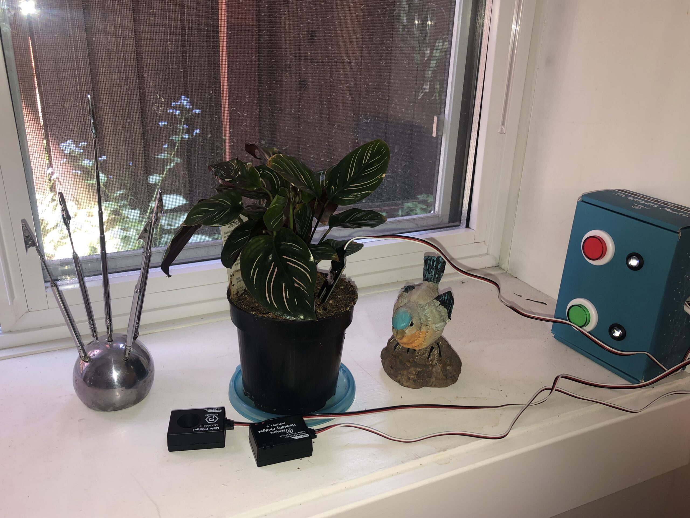
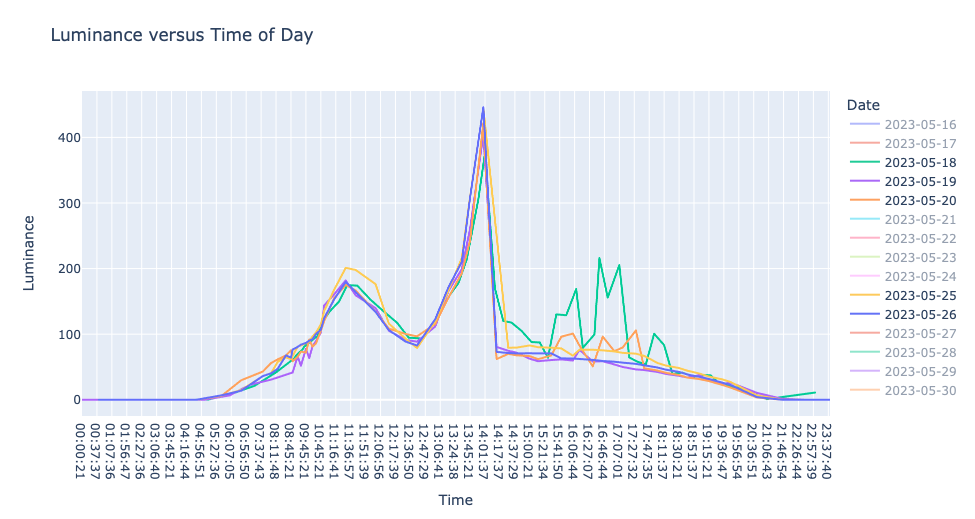

<h2>Callysto and Phidgets Education bridge physical computing and data science</h2>

Callysto has been collaborating with Phidgets Education for the past couple of years. Phidgets (which stands for Physical Widgets) are programmable USB sensors that can collect real-time data. These tools are widely used by STEM students, educators, and professionals globally.

This partnership is a natural fit since Phidgets provide a good way to collect a variety of data, and Callysto develops resources to analyze data.

In education, physical computing is vital, offering students an interactive, hands-on learning experience that connects theory with practice. With Phidgets and its starter kit, students can explore real-world sensors, buttons, and lights, integrating them into coding projects.

“With physical computing, a lot of time is spent getting the data, but there is not a lot about what to do with it afterwards,” says Lucas Pacentrilli, Director of Phidgets Education. “What Callysto is doing aligns well with what Phidgets do. We have science-based sensors that are quite accurate, and we have done all the work on the hardware side. All you have to do is collect this data and analyze it using [the notebooks] developed by Callysto.”

Building on this foundation, the Callysto team launched a <a href="https://bit.ly/plant-kit-lesson-plan" target="_blank" rel="noopener">lesson plan</a>, which centres around using the Phidgets Plant kit. This integrated approach enables students to apply real-world data science skills to information they are also collecting themselves.

<h3>Notebooks with curriculum connections to plants and botany</h3>

One particular area of our interest is collecting and visualizing plant and/or gardening data. Recently, Phidgets introduced a <a href="https://www.phidgets.com/education/learn/projects/plant-kit/" target="_blank" rel="noopener">Plant Kit</a> that includes a smart watering system that uses sensors to monitor humidity, light, temperature, and moisture levels.

Michael Lamoureux, Callysto’s BC Ambassador, used the kit to collect and analyze data on the light levels on a house plant. He noticed something interesting.

“Normally, you would expect that, at night time, it is dark and the light level is low,” says Michael. “As it starts to get brighter, the light level goes up, hits a spike, and then goes down in the evening. That’s how light works on the Earth. But when I analyzed the data, the light level would go up until 11:00 am, then it would go down for about an hour, and then around 12:30 pm it would go up again.

“I realized the tree in my backyard was blocking the sun mid-day, so when the sun moved behind the tree, it got dark for a while. Until you see the data, it doesn’t even occur to you that shadows are happening on my plant, which you can very easily see once you plot the data.”

Michaels's observations are an example of real-world applications of data science using Phidgets and our Callysto notebooks, and is a good example of how these tools can be used in classrooms.

For example, in Grade 5, students are tasked with analyzing climate and its relationship to weather conditions and agricultural practices, which is a good opportunity to introduce these tools. Additionally, in Grade 7, students are required to investigate and interpret the flow of energy and materials within ecosystems, with a particular focus on plants. Requirements like this are why we decided to create lesson plans for teachers using the Plant Kit.

<h3>Notebooks to analyze data collected using the Phidgets Plant Kit can be run on any operating system and browser</h3>

One of our key goals was to create notebooks that are complete and easy to use for students and teachers. Running the notebooks does not require the installation of additional software, or special permissions, and the data files are stored in an online, open spreadsheet (using Google Sheets or Ethercalc), making the data readily accessible to anyone.

We also ensured the notebooks run on any operating system: Windows, Mac OS, Linux, and even the inexpensive Raspberry Pi.

Our first notebook focused on collecting data using Phidgets and storing it. We created a second notebook to analyze the collected data using standard Python data analysis tools. Finally, we added a third notebook that automates the process of watering plants, leveraging the resources in the Phidgets Plant Kit. The kit includes a water pump and controller, and this notebook can turn the water pump on and off (to water the plant) while simultaneously monitoring data devices for temperature, humidity, light, and moisture.

Contemplating whether to automate the watering, we considered having the computer check the moisture level on a pre-determined schedule and "decide" when to water the plant. Given the potential water-related issues, we took precautions in our code to avoid a situation like "The Sorcerer’s Apprentice," the animated movie where Mickey Mouse starts watering the plants uncontrollably and cannot stop the flood. While our code mitigates this problem, we recommend that students and teachers keep their plants and water buckets in a water-tight container.

We hope these notebooks will enhance students’ grasp of STEM concepts and cultivate problem-solving skills and creativity.

<a href="https://bit.ly/plant-kit-lesson-plan" target="_blank" rel="noopener">Go to this link</a> for the lesson plan.
