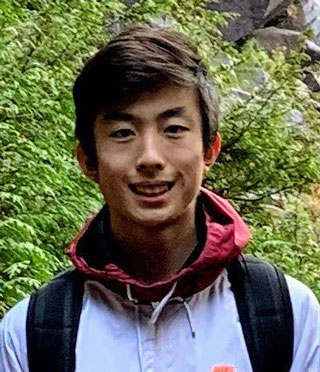

p>Since 2019, <a href="https://www.callysto.ca/" target="_blank" rel="noopener noreferrer">Callysto</a> has hosted three in-person student “hackathons” for students in Grades 7-12. “Hacking” in these events refers to students solving data-based challenges using coding and data analysis of open data sets. The goal of our hackathons, and the Callysto project in general, is to help students and teachers across Canada learn in-demand data science skills – which includes the ability to visualize, interpret, and analyze data.

<h2 class="wp-block-heading"><strong>“Zombie apocalypse” challenges</strong></h2>

Due to COVID-19, we turned our April 18, 2020, high school student hackathon into an online event. The 15 students who attended our online hackathon used data from <a href="https://opendata.vancouver.ca/pages/home/" target="_blank" rel="noreferrer noopener">Vancouver Open Data</a> to solve one of two challenges. Each challenge was presented in a virtual Callysto notebook:

1. Saving Vancouver’s public art: <em>It’s the year 2070. The zombie apocalypse hit Vancouver and you’re one of a few survivors. Before the apocalypse hit, you worked for the City of Vancouver. You still have a working computer, and access to the data sets about public artwork. Your mission is to save specific pieces of artwork and also, find particular artwork to get hidden emergency supplies.</em>

2. Rebuilding Vancouver’s parks: <em>The zombie apocalypse hit Vancouver a year ago. A mutation occurred which turned people into tree-eating zombies. To stay safe, locals and tourists avoided parks and outdoor activities. As a result, recreational outdoor businesses closed. The apocalypse is over; you’ve been hired by the City of Vancouver to get these businesses (and the local economy) back on its feet and recommend what trees to replant.</em>

<h2 class="wp-block-heading"><b>Meet our winners&nbsp;&nbsp;</b></h2>

We awarded prizes to two winners; they were chosen based on:

<ul><li>How they used Python code to solve problems within their challenge.</li><li>How they analyzed the data in their challenge to find trends and make recommendations.</li></ul>

We’re pleased to congratulate our winners, Grade 10 student Kristina Law and Grade 11 student Oliver Fang!

<h2 class="wp-block-heading">Kristina Law</h2>

<figure class="alignleft size-large"></figure>

<strong>Challenge scenario: Rebuilding Vancouver’s parks</strong> Why Kristina won: <i>Kristina’s recommendations to address park issues in post-apocalyptic Vancouver and the accuracy of her coding made her one of the hackathon winners. For example, one of her recommendations was to replant a variety of fruit trees to ensure there was fresh food throughout different growing seasons.</i>

<strong>Why did you choose to participate in the Callysto hackathon?</strong> “The main reason why I signed up was because of my interest in computer science and programming. I wanted an opportunity to exercise these skills and see how they can be used in other areas and jobs. I also wanted a chance to practice my programming and logical thinking skills.”

<strong>What did you enjoy most about the event?</strong> “I enjoyed the overall theme of the hackathon. By putting myself in a dire situation and role-playing as a data scientist in the aftermath of a zombie apocalypse, I had more at stake and more motivation to solve the problem. Analyzing and creating graphs allowed me to express my critical thinking skills.”

<strong>What was the main thing you learned?</strong> “The main thing I learned during this hackathon was more about Python code, specifically the pandas import. I learned how to use Python more educationally and got to see how it may be helpful to daily life.”

<em>(Note: “pandas” doesn’t refer to the cute black-and-white bears. Pandas is a tool in Python code which helps you quickly analyze and manipulate data. This could include creating tables or graphs.)</em>

<h2 class="wp-block-heading">Oliver Fang</h2>

<figure class="alignleft size-large"></figure>

<strong>Challenge scenario: Saving Vancouver’s art</strong> Why Oliver won: <em>Oliver’s creative thinking for why he chose to save specific pieces of art during the zombie apocalypse and the accuracy of his coding made him a hackathon winner. For example, one artwork Oliver chose to save was Vancouver’s <a href="https://covapp.vancouver.ca/PublicArtRegistry/ArtworkDetail.aspx?ArtworkId=528" target="_blank" rel="noreferrer noopener">Mind Crystal</a>. He observed the height of the artwork could make it a safe place for survivors to eat meals. He also said it could also be a shelter or a vantage point to view oncoming zombies.</em>

<strong>Why did you choose to participate in the Callysto hackathon?</strong> “I heard about this event from a friend that was also participating. We both have an interest in computer programming. We’re taking entry level programming this school year, and we wanted to expand our experience in the field of programming.”

<strong>What did you enjoy most about the event?</strong> “I definitely enjoyed creating amusing scenarios based on the data that we were analyzing. I found it incredibly fascinating learning about how we could visualize the immense amount of data that we were given, all through Python code.”

<strong>What was the main thing you learned?</strong> “As this was my first-ever hackathon, I learned that you’ll never know what’s going to happen unless you go for it. I was hesitant to join this hackathon at first because I had only just started coding, but I was willing to try new things. And at the end of the day, I knew I was going to come out of it learning something new, which I did.”

<h2 class="wp-block-heading">Host a Callysto virtual hackathon for your students</h2>

If you’re a Grades 5-12 teacher in Canada and are interested in Callysto hosting a virtual hackathon with your students, email <a href="mailto:contact@callysto.ca" target="_blank" rel="noopener noreferrer">contact@callysto.ca</a>.

