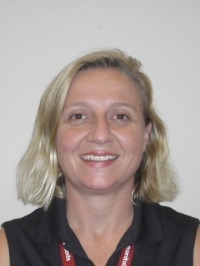
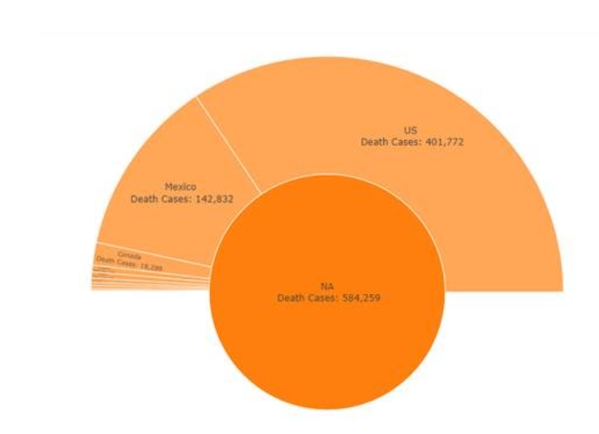

Lara Winstone first heard about Callysto at the October 2020 <a href="https://cuebc.ca/" target="_blank" rel="noopener">Computer Using Educators of British Columbia</a> conference. Winstone teaches computer science, information technologies (IT), and mathematics at <a href="https://westvancouverschools.ca/ecole-sentinel-secondary/" target="_blank" rel="noopener">Sentinel Secondary School</a> in Vancouver, British Columbia.

At the conference, she learned how Callysto can be used to teach students to develop and apply data science skills (coding, computational thinking, and data analysis and visualization). She thought Callysto’s free, online learning modules – which use Python code – would be a great fit for her Grade 11 IT class.&nbsp;

“I like to give my IT students a breadth of experience, and we also code in Python, so it was a nice fit,” she says. “I also realize that IT careers are evolving. I wanted to expose my students to data science, including data visualization.”&nbsp;

<h2><b>Using Callysto in the classroom</b></h2>

Winstone created activities for her students using Callysto’s <a href="https://www.callysto.ca/lesson-plans/" target="_blank" rel="noopener">lesson plans</a> for the&nbsp; <a href="unfair-dice-simulation.pdf" target="_blank" rel="noopener">unfair dice game</a> and <a href="Callysto_Lesson_on_Modelling_COVID-19-.pdf" target="_blank" rel="noopener">COVID-19</a> learning modules.

In the unfair dice game, students analyzed a rigged dice game. In the COVID-19 learning module, students explored the COVID-19 outbreak around the world.&nbsp;

Winstone gave her students the choice to work on the unfair dice game or the COVID-19 activity. Students answered reflection questions, on either activity, that included: 

<ul>
<li style="font-weight: 400;" aria-level="1">Why did you choose this activity?</li>
<li style="font-weight: 400;" aria-level="1">What information did you choose to capture?&nbsp;&nbsp;</li>
<li style="font-weight: 400;" aria-level="1">What data is being used in the learning module and how current is it?&nbsp;</li>
</ul>

She shared the work of one of her students (see below). This data visualization was created by a student who wanted to explore COVID-19 deaths in North America.&nbsp;

<b>Assignment question: </b>Why did you find this interesting? Explain your answer in 2-3 complete sentences.<b>&nbsp;</b>

<b>Student answer: </b><i>“I found the North American death case chart interesting due to the fact the US has more than 20X as many deaths as Canada, despite the US being less than 10X&nbsp; of Canada's population. I found the European deaths and total case charts interesting due to their comparison. In the European total case chart, Russia is at the top, but when it comes to deaths, they aren’t even within the top three.”</i>

“It was neat looking at the observations from my students when they submitted their assignments,” says Winstone. “It’s important for me to develop their critical thinking skills and these notebooks did just that, while also helping them expand their coding knowledge in Python and learn new data science skills.”&nbsp;

<h2><b>Reflecting on using Callysto</b>&nbsp;</h2>

For Winstone, using Callysto learning materials in the classroom was beneficial in several ways, including:

1. Giving students the opportunity to develop a core competency in the BC curriculum, critical thinking, in a tangible way.

Core competencies are skills students develop over time and throughout their academic life.

2. Providing learning materials that don't require students, teachers, or anyone interested in learning more about data science to be a programmer.

Winstone says Callysto's beginner learning materials are designed so they just need to be "worked through" to gain meaning, without having to code (Callysto's <a href="https://www.callysto.ca/weekly-data-visualization/" target="_blank" rel="noopener">data visualization exercises</a> are one example). For teachers or students who are programmers, Winstone says Callysto's learning modules are a great way to let them experiment with open data. Teacher or student programmers can also use the Callysto Hub (Callysto's free, online workspace) to explore data sets that interest them by creating their own Jupyter notebooks. A Jupyter notebook is a free, online document where you can use live code (all Callysto learning modules are built using Jupter notebooks).

You can find Winstone’s activities, which are freely-available for teachers to use, here: 

<ul>
<li style="font-weight: 400;" aria-level="1">Assignment 1: <a href="https://drive.google.com/file/d/1w1_OJ-3rMO8_NCkhpn_SbGQJZhQkHoNP/view?usp=sharing" target="_blank" rel="noopener">COVID-19 and data science&nbsp;</a></li>
<li style="font-weight: 400;" aria-level="1">Assignment 2: <a href="https://drive.google.com/file/d/1PN-HqhtLjdssw8aw3z0ZDy6UtyX7pw0K/view?usp=sharing" target="_blank" rel="noopener">Computational thinking - COVID-19 and the unfair dice game</a></li>
</ul>
<h2><b>Interested in learning more? Contact us!</b></h2>

If you’re a Grades 5-12 teacher interested in learning how to use Callysto in your classroom, email us at <a href="mailto:contact@callysto.ca" target="_blank" rel="noopener">contact@callysto.ca</a>.
