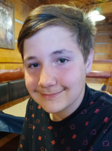

This past July, the Callysto team had the pleasure to join grades 9-10 students in Alberta as part of the PIMS-led math camp: <a href="https://www.pims.math.ca/educational-event/210726-dmhsmcis" target="_blank" rel="noopener">Diversity in Mathematics</a>. This week-long event was geared towards Indigenous students who are interested in pursuing careers in STEM, and are looking to develop their math skills. The event included instructors from Maskwacis Education Schools, the University of Alberta, Big River Analytics, and our own data scientist, Laura Gutierrez-Funderburk. 
 
Laura introduced students to our Callysto notebooks, and set them to work on the <a href="https://www.callysto.ca/2021/01/19/data-analysis-and-fish-traps/" target="_blank" rel="noopener">Coast Salish fish traps notebook</a>. The Coast Salish people are based in the Pacific Northwest coast of Canada and the US, where salmon fishing has formed an important part of their culture and history. They have traditionally used coastal rock walls to trap fish when the tides are low.

<iframe loading="lazy" id="igraph" class="post-img-shadow" style="border: none;" src="https://callysto.github.io/Indigenous-culture-through-math-and-code/pictures/map.html" width="100%" height="600" scrolling="no" seamless="seamless"></iframe>

The Callysto Fish Traps notebook focuses on crescent-shaped fish traps (semi- or completely circular stone walls), and invites students to model how they work, and when is the ideal time to use them. Particular attention needs to be paid to tidal patterns, the slope of the shore, the height of the trap, and the proximity of the community to the fish trap.

<iframe loading="lazy" id="igraph" class="post-img-shadow" style="border: none;" src="https://callysto.github.io/Indigenous-culture-through-math-and-code/pictures/fish_trap_simulation.html" width="100%" height="600" scrolling="no" seamless="seamless"></iframe>

Students were also invited to model the fish traps in other locations in Canada.

<h3>A new way to practice coding</h3>

<figure id="attachment_4669" aria-describedby="caption-attachment-4669" style="width: 223px" class="wp-caption alignright"><figcaption id="caption-attachment-4669" class="wp-caption-text">Ben Blatz was one of the students who attended the Diversity in Mathematics 2021 summer camp</figcaption></figure>

Ben Blatz was one of the students who attended the virtual math camp. A 14-year-old living in Edmonton, he was looking to boost his math skills before entering high school.

“I’ve done a bit of coding before, and really enjoyed it,” he says. “I’ve also seen my other friends do coding, and wanted to see how it worked. I think it would be a good job for me in the future.”

Ben adapted the Fish Traps notebook to model fishing scenarios in Black Rock Point, Nova Scotia. He says he found the entire scenario very interesting, and enjoyed adapting his coding skills for a completely new experience.

“It was really easy for me once I saw how it worked, then everything just clicked.”

He also appreciated the opportunity to learn about how the Coast Salish people carried out their unique style of fishing.

Ben hopes to continue building on his coding skills, and one day become a video game designer. He also says he will be looking out for future coding camps like this.

<!-- 
For more information on Callysto’s Indigenous learning content, <a href="https://www.callysto.ca/indigenous-content/">visit our webpage</a>. If you are a teacher and are interested in organizing a data science learning event for your class, please contact us at <a href="mailto:contact@callysto.ca">contact@callysto.ca</a>.
 -->