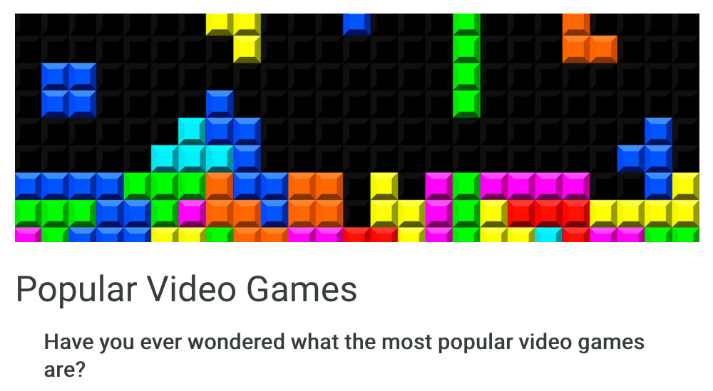

<i>This blog post was written by Callysto team member Dr. Verena Roberts. Dr. Roberts is a Callysto Education Specialist and a former online high school teacher with Rocky View Schools, in Alberta, Canada (she stepped away from her teaching role in January 2021).</i>

In my previous blog post, I talked about the value of incorporating data visualizations into non-traditional classes, like English, while meeting formal Alberta curriculum outcomes. This blog describes how I recently did just that.

<h3>Connecting the ePortfolio Reflections to ELA 20-2 Course Outcomes and Formal writing Performance tasks</h3>

The intention was for students, after they had completed the four formal units in their ELA 20-2 course, to go back through their ePortfolio weekly reflections and choose one that stood out to them in a meaningful way.

They were asked to expand upon that personal reflection, and write a Persuasive Written Response <strong>OR</strong> a Visual Response to that original reflection.

The Persuasive Written Response and the Visual Response are two of the formats used on the ELA 30-2 diploma exam. They make up most of the written text in the ELA 20-2 formal assignments.

Descriptions of both formats can be found here:

<ul>
<li><a href="https://docs.google.com/document/d/15TEd5_fKKCvGIht9Dm9HUd6muSjroerX2Fd0rZxjqUU/edit#" target="_blank" rel="noopener">Persuasive Writing Resources</a></li>
<li><a href="https://docs.google.com/document/d/1mtY766B8twD-A_fA4tKX9i2GrYP-PTB8ker8vqWyipQ/edit" target="_blank" rel="noopener">Visual Response</a></li>
</ul>

One example of a weekly provocation was the <a href="https://callysto.github.io/website/dataviz/popular-video-games/">Popular Video Games Data Visualization</a> created by the Callysto team for the ELA 20-2 course.

<a href="https://callysto.github.io/website/dataviz/popular-video-games/">
</a>

Keep in mind that the students were given the option to choose the provocation topics that were of most interest to them, and the data visualization was just one of the available topics.

Of the 12 students who responded to the activity, two of them chose the video game visualization.

<a href="https://docs.google.com/presentation/d/1iVIDQM_wB-dYSefeoCRyYUqPs1xjs86DfO3v8jDHKKI/edit#slide=id.gbc31093b0c_0_797" target="_blank" rel="noopener">These slides</a> describe the sequence of steps I took to integrate the data visualization into my course.

<h3>Student Assignments</h3>

One student completed the <a href="https://docs.google.com/document/d/1lZc0_5eAP3XsO3b_3dWxoEFlpF04_NtO/edit" target="_blank" rel="noopener">reflection part</a> of the assignment.

Daniel Jones, another student in ELA 20-2 at Rocky View Schools, connected the data visualization to his formal writing. He chose to use a <a href="https://docs.google.com/document/d/10R_jVtJf-wttpvV36EGPtciGFfROO83d/edit" target="_blank" rel="noopener">persuasive speech</a> to integrate what he had learned.

The Video Games Data Visualization clearly connected with both students, and helped them integrate data literacy into their English class environment.

<h3>What I learned</h3>

I learned the value of connecting student’s interested media in my courses, to increase their engagement.

What made this activity that much more exciting was the ease with which I could design an interdisciplinary learning exercise within a high school English class.

<h2>Learn more</h2>

If you have questions about how to use Callysto’s free, online learning resources in your classroom, email us at <a href="mailto:contact@callysto.ca">contact@callysto.ca</a>.
