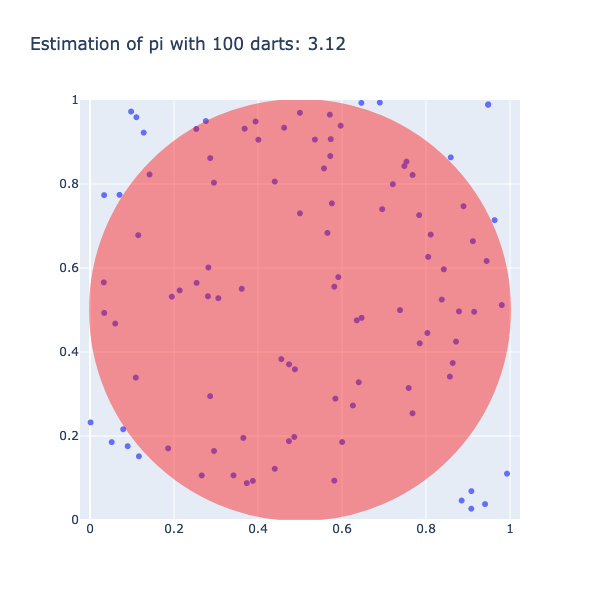

<h2> Can you calculate Pi by throwing darts?</h3>

<b>Grades 5-12</b>

What if we told you the key to unlocking the secrets of the number Pi(π) lies in the simple act of throwing darts?

Pi is a mathematical constant that represents the ratio of the circumference of a circle to its diameter. It is an irrational number, which means it cannot be represented as a ratio of two integers. While throwing darts might seem like an unconventional way to calculate a mathematical constant, it's a great way to demonstrate the power of mathematical concepts and visualization.

&nbsp;

If you throw darts randomly at a square surrounding a circle (dartboard), and calculate the ratio of the number of darts that land inside the circle to the total number of darts thrown, you should be able to calculate an approximate value of Pi. This is because the ratio is proportional to the area of the circle within the area of the square. The value of Pi can therefore be approximated by multiplying this ratio by 4.

<a href="https://www.youtube.com/watch?v=M34TO71SKGk">This video</a> by Physics Girl on Youtube explains the process of calculating Pi by throwing darts.

In the visualization above, notice how the number of darts thrown changes the calculated value of Pi. The more darts are thrown, the better the results become. With a large number of darts, this simple method can give us a good approximation of Pi.

So, next time you're hanging out with friends, challenge them to a game of dartboard Pi. Who knows, you might just become the next Pi champion!

<h2><b>Reflect on what you see</b></h2>

Look at the visualizations above and notice how the number of darts thrown changes the calculated value of Pi.

<strong>Think about the following questions.</strong>

<ul>
<li>What do you notice about the visualizations?</li>
<li>What do you wonder about the data?</li>
</ul>
<h4><b>Use the fill-in-the-blank prompts to summarize your thoughts.</b></h4>
<ul>
<li aria-level="1">“I used to think _______”</li>
<li aria-level="1">“Now I think _______”</li>
<li aria-level="1">“I wish I knew more about _______”</li>
<li aria-level="1">“These data visualizations remind me of _______”</li>
<li aria-level="1">"I really like _______”</li>
</ul>
<h2><b>Learn how we visualized the data</b></h2>

Go to our <a href="https://bit.ly/3cLonyj" target="_blank" rel="noopener">walk-through</a> (in Jupyter notebook format) to see how the data science process was applied to creating the graph from formulating a question, gathering the data, and analyzing the data with code to creating the graph.
