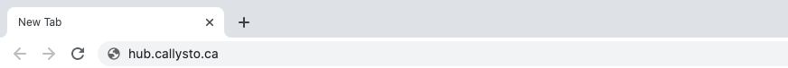
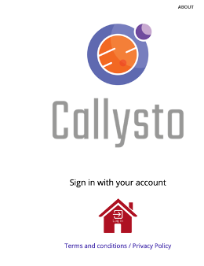
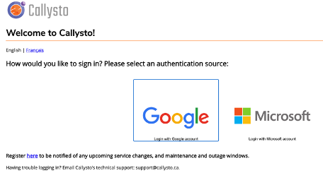

The purpose of this starter kit is to get you comfortable with using Callysto’s free, online curriculum-tied modules in your classroom.

<h4>What do you and your students need to use Callysto?</h4>
<ul>
<li>A computer</li>
<li>A secure internet connection</li>
<li>An internet browser (Google Chrome or FireFox are ideal)</li>
</ul>

<h2>Get Familiar with Callysto</h2>



The “Hub” is your free, online workspace for the Callysto learning modules you use. <a href="CallystoPrivacyNotice-July2019.pdf">We don’t store any personal information</a>.

<strong>Video demonstration 
</strong>(Less than 2 minutes)

<!--  -->
<video src="Final-updated-export-callysto-login-from-hub_1.mp4" controls></video>
<!-- <video src="Final-updated-export-callysto-login-from-hub_1.mp4" width="320" height="240" controls></video> -->

<strong>Visual guide</strong>

1. Open your internet browser and type hub.callysto.ca.

2. Click on the red house.

3. Sign in with your Google or Microsoft account.




<h4>2A. Understand what you see when you log in</h4>

You’re logged in! You should see the Callysto Hub “landing page” (pictured below) which has three tabs:

<ul>
<li><strong>Files</strong>: this is a file directory system that shows all of the Callysto notebooks/modules you’ve opened, or are working on.</li>
<li><strong>Running</strong>: these are the notebooks that you have open in your Hub environment.</li>
<li><strong>Clusters</strong>: this is a more technical feature; you don’t need to know how to use it when you’re learning Callysto for the first time.</li>
</ul>

<h4>2B. Understand the main parts of a Callysto notebook</h4>

Callysto learning modules are based on “Jupyter notebooks” – an open-source platform that lets you create and share content (including functions, text, and media) using code. You don’t need to know how to code in order to use a notebook – this section explains what the main parts of a Callysto learning module are, so you understand what you’re looking at.

<strong>Video demonstration</strong> 
(It’s approximately 6 minutes long.)

<video src="parts-of-a-callysto-notebook.mp4" controls></video>


<h4></h4>
<h4>2B. Understand the main parts of a Callysto notebook</h4>

Callysto learning modules are based on “Jupyter notebooks” – an open-source platform that lets you create and share content (including functions, text, and media) using code. You don’t need to know how to code in order to use a notebook – this section explains what the main parts of a Callysto learning module are, so you understand what you’re looking at.

<strong>Video demonstration</strong> 
(It’s approximately 6 minutes long.)

Video Player

<mediaelementwrapper id="video-241-2"><video class="wp-video-shortcode" id="video-241-2_html5" width="1120" height="720" preload="metadata" src="https://www.callysto.ca/wp-content/uploads/2020/10/parts-of-a-callysto-notebook.mp4?_=2" style="width: 1060px; height: 662.5px;"><source type="video/mp4" src="https://www.callysto.ca/wp-content/uploads/2020/10/parts-of-a-callysto-notebook.mp4?_=2"><a href="https://www.callysto.ca/wp-content/uploads/2020/10/parts-of-a-callysto-notebook.mp4">https://www.callysto.ca/wp-content/uploads/2020/10/parts-of-a-callysto-notebook.mp4</a></video></mediaelementwrapper>

<button type="button" aria-controls="mep_1" title="Play" aria-label="Play" tabindex="0"></button>

00:00

00:00

06:18

<button type="button" aria-controls="mep_1" title="Mute" aria-label="Mute" tabindex="0"></button><a href="javascript:void(0);" class="mejs-volume-slider" aria-label="Volume Slider" aria-valuemin="0" aria-valuemax="100" role="slider" aria-orientation="vertical" aria-valuenow="80" aria-valuetext="80%">Use Up/Down Arrow keys to increase or decrease volume.

</a>

<button type="button" aria-controls="mep_1" title="Fullscreen" aria-label="Fullscreen" tabindex="0"></button>

<strong>Visual guide</strong>

<ul>
<li><strong>A: “+”</strong>– this allows you to add another cell.</li>
<li><strong>B: “Scissors”</strong>– this allows you to remove a cell you added.</li>
<li><strong>C: “Run”</strong>– this is what you click to make specific cells of your notebook work, i.e. “run the contents of either the “Code” or “Markdown” cell”.</li>
<li><strong>D: Cell dropdown area</strong> – this allows you to change a cell from a code cell to a markdown cell, or vice-versa.</li>
<li><strong>E: Code cell</strong> – this type of cell allows you to add in, or “holds” Python code. You know it’s a Code cell because the dropdown indicator (“D”) says “Code”. Also to the left of the cell you’ll see “In [ ]:”.</li>
<li><strong>F: Markdown cell</strong> – this type of cell allows you to add in, or “holds” text or pictures.&nbsp; You know it’s a Markdown cell because the dropdown indicator (“D”) says “Markdown.”</li>
</ul>
				

			

						

				

					
					<a href="javascript:void(0);" id="fl-accordion-5f90aa6c3e7fa-label-2" class="fl-accordion-button-label" tabindex="0" aria-controls="fl-accordion-5f90aa6c3e7fa-panel-2">3. Watch a Walk-through of a Learning Module</a>

											<a href="https://www.callysto.ca/starter-kit/#" id="fl-accordion-5f90aa6c3e7fa-icon-2" class="fl-accordion-button-icon" tabindex="-1" aria-controls="fl-accordion-5f90aa6c3e7fa-panel-2"><i class="fl-accordion-button-icon fl-accordion-button-icon-right fas fa-plus">Expand</i></a>
					
				

				

					
This walk-through looks at our learning module about climate-based open data, such as global temperatures. The module is a way for students to explore:

<ul>
<li>How to analyze graphs based on open data</li>
<li>How to interpret the results they see from the data.</li>
</ul>

You can also email us at <a href="mailto:contact@callysto.ca" target="_blank" rel="noopener">contact@callysto.ca</a> to schedule a walk-through of a module of your choice.

Video Player

<mediaelementwrapper id="video-241-3"><video class="wp-video-shortcode" id="video-241-3_html5" width="1200" height="698" preload="metadata" src="https://www.callysto.ca/wp-content/uploads/2020/12/final-data-science-learning-module.mp4?_=3" style="width: 1060px; height: 596.25px;"><source type="video/mp4" src="https://www.callysto.ca/wp-content/uploads/2020/12/final-data-science-learning-module.mp4?_=3"><a href="https://www.callysto.ca/wp-content/uploads/2020/12/final-data-science-learning-module.mp4">https://www.callysto.ca/wp-content/uploads/2020/12/final-data-science-learning-module.mp4</a></video></mediaelementwrapper>

<button type="button" aria-controls="mep_2" title="Play" aria-label="Play" tabindex="0"></button>

00:00

00:00

04:12

<button type="button" aria-controls="mep_2" title="Mute" aria-label="Mute" tabindex="0"></button><a href="javascript:void(0);" class="mejs-volume-slider" aria-label="Volume Slider" aria-valuemin="0" aria-valuemax="100" role="slider" aria-orientation="vertical" aria-valuenow="80" aria-valuetext="80%">Use Up/Down Arrow keys to increase or decrease volume.

</a>

<button type="button" aria-controls="mep_2" title="Fullscreen" aria-label="Fullscreen" tabindex="0"></button>

				

			

			

	

	

		

	

	

						

		

			

	

	

		

	<h2 style="text-align: center;">Try Callysto Yourself: Mini Lesson Plan</h2>
<h4>Required Materials</h4>
<ul>
<li>A computer or Chromebook for each student (tablets will also work, but not as well).</li>
<li>Internet access (most browsers will work, although Internet Explorer is not recommended).</li>
</ul>
<h4>Preparation</h4>
<ul>
<li>Ensure your students know how to log into their Google or Microsoft account (Callysto does not collect any personally identifiable information)</li>
<li>Review all the material in the “Get familiar with Callysto” section above.</li>
<li>Select a<a href="https://www.callysto.ca/learning_modules/"> Callysto learning module</a> you want to explore with your students.</li>
</ul>
<h4>During the Activity</h4>

(Content in italics is a suggestion of what you can say to students)

	

	

			

	

	

		

				

				

					
					<a href="javascript:void(0);" id="fl-accordion-5f91bda224f78-label-0" class="fl-accordion-button-label" tabindex="0" aria-controls="fl-accordion-5f91bda224f78-panel-0">1. Introduce Data Science</a>

											<a href="https://www.callysto.ca/starter-kit/#" id="fl-accordion-5f91bda224f78-icon-0" class="fl-accordion-button-icon" tabindex="-1" aria-controls="fl-accordion-5f91bda224f78-panel-0"><i class="fl-accordion-button-icon fl-accordion-button-icon-right fas fa-plus">Expand</i></a>
					
				

				

					
Start a discussion with your students about data science. Here's what we recommend:

<ol>
<li><strong>Go to the <a href="https://www.gapminder.org/">Gapminder website</a>.</strong> Gapminder is an organization which uses data to promote facts. They also have ready-made data visualizations on a variety of topics.</li>
<li><strong>Go to Gapminder's <a href="https://www.gapminder.org/tools/#$chart-type=bubbles">“tools” page</a>.</strong> This is where you can choose a variety of data visualizations.</li>
<li><strong>After you choose a visualization, ask the students questions:</strong></li>
</ol>
<ul>
<li>What patterns do you notice in the data?</li>
<li>What questions do you have about the information you see?</li>
<li>What conclusions can be made from this data?</li>
</ul>
				

			

						

				

					
					<a href="javascript:void(0);" id="fl-accordion-5f91bda224f78-label-1" class="fl-accordion-button-label" tabindex="0" aria-controls="fl-accordion-5f91bda224f78-panel-1">2. Explain Why Data Science is Important</a>

											<a href="https://www.callysto.ca/starter-kit/#" id="fl-accordion-5f91bda224f78-icon-1" class="fl-accordion-button-icon" tabindex="-1" aria-controls="fl-accordion-5f91bda224f78-panel-1"><i class="fl-accordion-button-icon fl-accordion-button-icon-right fas fa-plus">Expand</i></a>
					
				

				

					
<em>Data science skills, including data analysis and coding, can help you solve problems in a variety of subjects. These skills are also important when you’re looking for a job. Data science skills also help you spot misinformation online, such as misleading graphs.</em>

				

			

						

				

					
					<a href="javascript:void(0);" id="fl-accordion-5f91bda224f78-label-2" class="fl-accordion-button-label" tabindex="0" aria-controls="fl-accordion-5f91bda224f78-panel-2">3.  Explain What Callysto is</a>

											<a href="https://www.callysto.ca/starter-kit/#" id="fl-accordion-5f91bda224f78-icon-2" class="fl-accordion-button-icon" tabindex="-1" aria-controls="fl-accordion-5f91bda224f78-panel-2"><i class="fl-accordion-button-icon fl-accordion-button-icon-right fas fa-plus">Expand</i></a>
					
				

				

					
<em>We’re going to practice your data science skills using Callysto. Callysto uses something called “Jupyter notebooks”, which is an online platform used by many university classes to build and share live content. All Callysto learning modules use the Python programming language, which is also the programming language used by most data scientists.</em>

				

			

						

				

					
					<a href="javascript:void(0);" id="fl-accordion-5f91bda224f78-label-3" class="fl-accordion-button-label" tabindex="0" aria-controls="fl-accordion-5f91bda224f78-panel-3">4. Get Students to Log In</a>

											<a href="https://www.callysto.ca/starter-kit/#" id="fl-accordion-5f91bda224f78-icon-3" class="fl-accordion-button-icon" tabindex="-1" aria-controls="fl-accordion-5f91bda224f78-panel-3"><i class="fl-accordion-button-icon fl-accordion-button-icon-right fas fa-plus">Expand</i></a>
					
				

				

					
Get students to log in to <a href="http://hub.callysto.ca/">hub.callysto.ca</a> with their Google or Microsoft account.

				

			

						

				

					
					<a href="javascript:void(0);" id="fl-accordion-5f91bda224f78-label-4" class="fl-accordion-button-label" tabindex="0" aria-controls="fl-accordion-5f91bda224f78-panel-4">5. Provide the Learning Module</a>

											<a href="https://www.callysto.ca/starter-kit/#" id="fl-accordion-5f91bda224f78-icon-4" class="fl-accordion-button-icon" tabindex="-1" aria-controls="fl-accordion-5f91bda224f78-panel-4"><i class="fl-accordion-button-icon fl-accordion-button-icon-right fas fa-plus">Expand</i></a>
					
				

				

					
Provide students the link to the learning module they’ll be using.

We suggest students start with our <a href="http://bit.ly/curiosity-challenge0">Pets on Mars</a> module if they're new to data science and Python programming.

Have you opened this learning module before, and get an error message when you try to open it now? If so, you may need to delete the copy of this learning module that’s in your Callysto Hub. <a href="https://www.youtube.com/watch?v=9WlxLlwS5t8&amp;feature=youtu.be">Click here for instructions</a>.

				

			

						

				

					
					<a href="javascript:void(0);" id="fl-accordion-5f91bda224f78-label-5" class="fl-accordion-button-label" tabindex="0" aria-controls="fl-accordion-5f91bda224f78-panel-5">6. Help Students Get Started</a>

											<a href="https://www.callysto.ca/starter-kit/#" id="fl-accordion-5f91bda224f78-icon-5" class="fl-accordion-button-icon" tabindex="-1" aria-controls="fl-accordion-5f91bda224f78-panel-5"><i class="fl-accordion-button-icon fl-accordion-button-icon-right fas fa-plus">Expand</i></a>
					
				

				

					
Help them get started with the learning module(s).

Explain the main parts of a Callysto learning module: markdown cells, code cells, the “run” function, etc. Please refer to the section above, “Get familiar with Callysto.”

				

			

						

				

					
					<a href="javascript:void(0);" id="fl-accordion-5f91bda224f78-label-6" class="fl-accordion-button-label" tabindex="0" aria-controls="fl-accordion-5f91bda224f78-panel-6">7. Get Students to Send a Module to You</a>

											<a href="https://www.callysto.ca/starter-kit/#" id="fl-accordion-5f91bda224f78-icon-6" class="fl-accordion-button-icon" tabindex="-1" aria-controls="fl-accordion-5f91bda224f78-panel-6"><i class="fl-accordion-button-icon fl-accordion-button-icon-right fas fa-plus">Expand</i></a>
					
				

				

					
The simplest way for students to send you their completed modules is to download it in Jupyter notebook file format (.ipynb). From there, they can email or upload it to a storage area of your choosing.

<strong>Video overview</strong>

Video Player

<mediaelementwrapper id="video-241-4"><video class="wp-video-shortcode" id="video-241-4_html5" width="1200" height="698" preload="metadata" src="https://www.callysto.ca/wp-content/uploads/2020/11/How-students-download-notebooks.mp4?_=4" style="width: 1060px; height: 596.25px;"><source type="video/mp4" src="https://www.callysto.ca/wp-content/uploads/2020/11/How-students-download-notebooks.mp4?_=4"><a href="https://www.callysto.ca/wp-content/uploads/2020/11/How-students-download-notebooks.mp4">https://www.callysto.ca/wp-content/uploads/2020/11/How-students-download-notebooks.mp4</a></video></mediaelementwrapper>

<button type="button" aria-controls="mep_3" title="Play" aria-label="Play" tabindex="0"></button>

00:00

00:00

01:07

<button type="button" aria-controls="mep_3" title="Mute" aria-label="Mute" tabindex="0"></button><a href="javascript:void(0);" class="mejs-volume-slider" aria-label="Volume Slider" aria-valuemin="0" aria-valuemax="100" role="slider" aria-orientation="vertical" aria-valuenow="80" aria-valuetext="80%">Use Up/Down Arrow keys to increase or decrease volume.

</a>

<button type="button" aria-controls="mep_3" title="Fullscreen" aria-label="Fullscreen" tabindex="0"></button>

<strong>Visual guide</strong>

<ul>
<li>Click “File”</li>
<li>Click “Download as”</li>
<li>Select “Notebook (.ipynb)</li>
</ul>

				

			

						

				

					
					<a href="javascript:void(0);" id="fl-accordion-5f91bda224f78-label-7" class="fl-accordion-button-label" tabindex="0" aria-controls="fl-accordion-5f91bda224f78-panel-7">8. Upload the Callysto Notebooks You Receive</a>

											<a href="https://www.callysto.ca/starter-kit/#" id="fl-accordion-5f91bda224f78-icon-7" class="fl-accordion-button-icon" tabindex="-1" aria-controls="fl-accordion-5f91bda224f78-panel-7"><i class="fl-accordion-button-icon fl-accordion-button-icon-right fas fa-plus">Expand</i></a>
					
				

				

					
When students send you their Callysto notebooks (i.e. as .ipynb files) here’s how you can upload to your Callysto Hub.

<strong>Video overview 
</strong>(It's just over 2 minutes.)

Video Player

<mediaelementwrapper id="video-241-5"><video class="wp-video-shortcode" id="video-241-5_html5" width="1200" height="698" preload="metadata" src="https://www.callysto.ca/wp-content/uploads/2020/11/How-teachers-upload-student-notebooks.mp4?_=5" style="width: 1060px; height: 596.25px;"><source type="video/mp4" src="https://www.callysto.ca/wp-content/uploads/2020/11/How-teachers-upload-student-notebooks.mp4?_=5"><a href="https://www.callysto.ca/wp-content/uploads/2020/11/How-teachers-upload-student-notebooks.mp4">https://www.callysto.ca/wp-content/uploads/2020/11/How-teachers-upload-student-notebooks.mp4</a></video></mediaelementwrapper>

<button type="button" aria-controls="mep_4" title="Play" aria-label="Play" tabindex="0"></button>

00:00

00:00

02:07

<button type="button" aria-controls="mep_4" title="Mute" aria-label="Mute" tabindex="0"></button><a href="javascript:void(0);" class="mejs-volume-slider" aria-label="Volume Slider" aria-valuemin="0" aria-valuemax="100" role="slider" aria-orientation="vertical" aria-valuenow="80" aria-valuetext="80%">Use Up/Down Arrow keys to increase or decrease volume.

</a>

<button type="button" aria-controls="mep_4" title="Fullscreen" aria-label="Fullscreen" tabindex="0"></button>

<strong>Visual guide</strong>

<h4>A. Create a folder on your desktop, or a folder on your computer to save the notebooks.</h4>
<h4>B. Log into your Callysto Hub</h4>
<h4>C. Create a new folder</h4>
<ol>
<li>Click “New.”</li>
<li>Click “Folder.”</li>
<li>Your new folder will appear under the “Files” tab as “Untitled folder.”</li>
</ol>

<h4>D. Rename your folder</h4>
<ol>
<li>Click the box to the left of your folder.</li>
<li>Click “Rename.”</li>
<li>Type a name below “Enter a new directory name.”</li>
<li>Click “Rename.”</li>
</ol>

 

<h4>E. Upload the student notebooks</h4>
<ul>
<li>When you’re in your newly-renamed folder, click “Upload.” This will open a pop-up box, where you can select the area you saved the student’s notebooks.</li>
</ul>

				

			

			

	

	

		

	

	

						

		

			

	

	

		

	<h2 style="text-align: center;">Get a Callysto Expert to Teach Your Students</h2>

We’re here to help! If you’d like us to lead a session for your students, email us at <a href="mailto:contact@callysto.ca">contact@callysto.ca</a>

We’ve held numerous data science sessions (in-person and online) for Grades 5-12 students across Canada. Our most popular events are our virtual hackathons, such as our <a href="https://www.callysto.ca/2020/09/10/students-seek-a-sustainable-life-on-mars-as-part-of-callysto-hackathon/">“Sustaining Life On Mars” hackathon.</a>

<h3>What you need to know about Callysto’s classroom sessions</h3>
<ul>
<li>Sessions are free to Grades 5-12 classrooms in Canada.</li>
<li>The content can be tailored to your specific classroom curricula.</li>
<li>Classroom sessions are typically one hour.</li>
<li>Sessions can be scheduled Monday to Friday, 8am-4pm Mountain Daylight Time.</li>
</ul>

	

	

		

	

